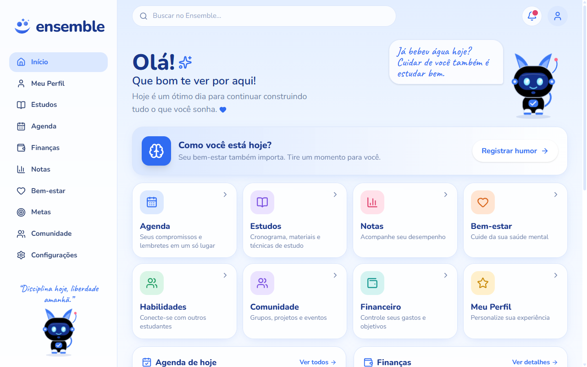
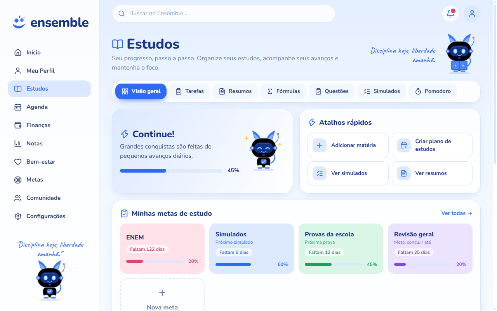
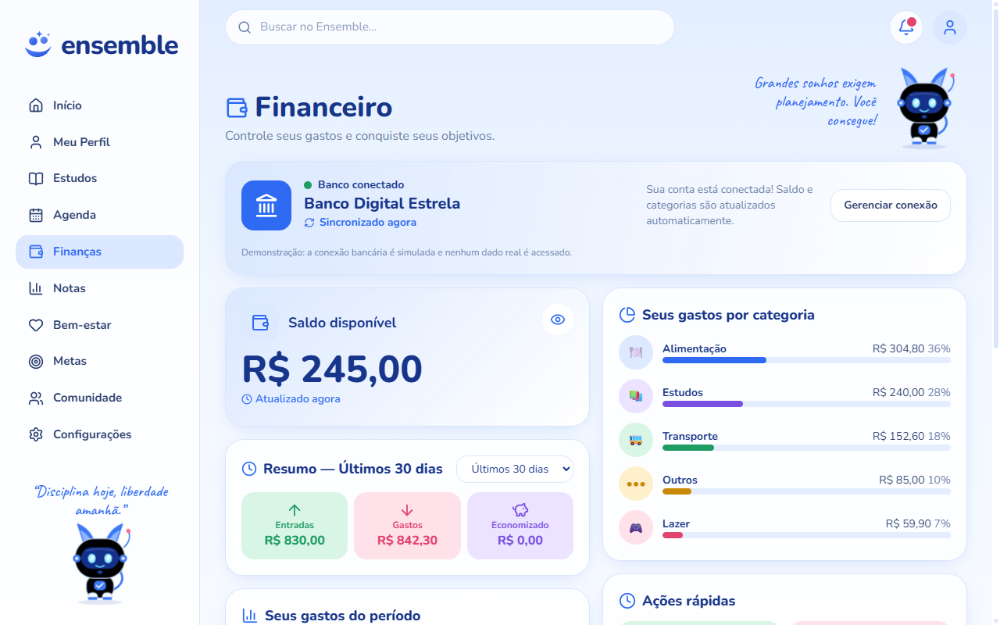
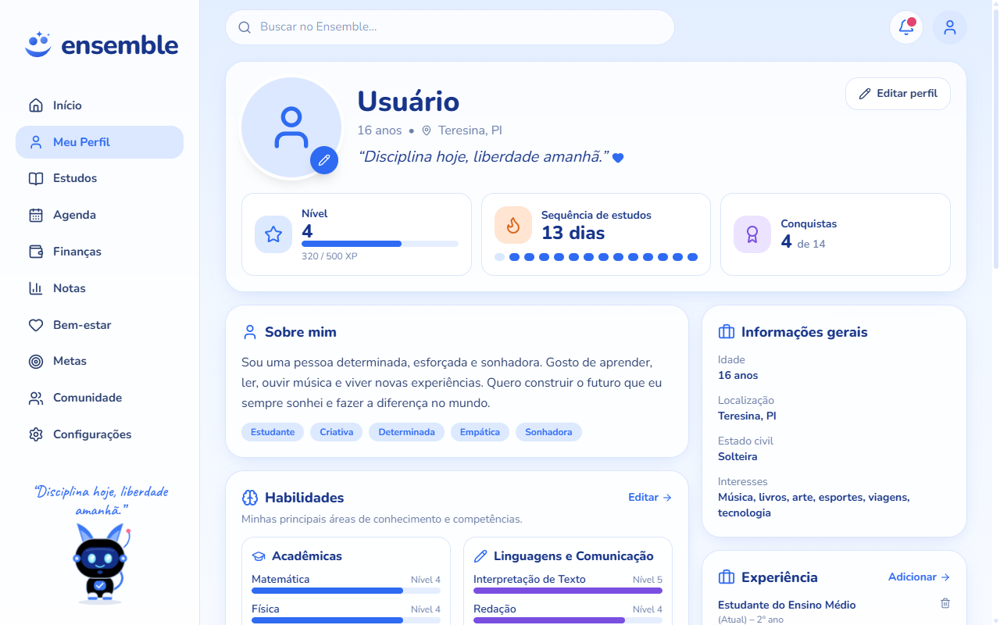

<div align="center">

# ensemble

**Estudos, agenda, finanças e bem-estar em um só lugar, com um mascote que torce por você.**

Projeto InovaTech · UNINASSAU

[](https://ensemble-chi-one.vercel.app)


**[Acessar o app](https://ensemble-chi-one.vercel.app)** · **[Documentação](docs/DOCUMENTACAO.md)**



</div>

## Sobre o projeto

O **Ensemble** é um app para estudantes organizarem a vida acadêmica sem pular de aplicativo em aplicativo. Ele junta cronograma de estudos, agenda, controle financeiro e cuidado com a saúde mental, e transforma o uso diário em jogo: XP, níveis, sequência de estudos, conquistas e um mascote robô-pet.

É uma **demo 100% funcional**, sem login e sem servidor. Tudo fica salvo no navegador, então dá para abrir e usar na hora.

## Telas

<table>
  <tr>
    <td align="center"><br><b>Estudos</b></td>
    <td align="center"><br><b>Financeiro</b></td>
  </tr>
  <tr>
    <td align="center" colspan="2"><br><b>Perfil</b></td>
  </tr>
</table>

## Funcionalidades

| Módulo | O que faz |
|---|---|
| **Início** | Resumo do dia: agenda, tarefas, finanças, provas e humor |
| **Estudos** | Tarefas, resumos, fórmulas, questões, simulados, Pomodoro, matérias, metas e cronograma semanal |
| **Agenda** | Calendário mensal, compromissos por categoria e tarefas pendentes |
| **Financeiro** | Saldo, entradas e gastos, gráfico, categorias, metas e relatórios (banco simulado) |
| **Notas** | Registro e acompanhamento de desempenho por matéria |
| **Bem-estar** | Humor do dia, respiração guiada e diário |
| **Perfil** | Nível e XP, sequência de estudos, conquistas, habilidades, experiência e troca de espécie do mascote |
| **Comunidade** | Grupos e eventos, com entrada e saída |
| **Configurações** | Tema claro/escuro, dados de exemplo e reset |

## Gamificação

- Cada nível exige **500 XP**. Tarefa concluída rende +10 XP, Pomodoro +15 e simulado +30.
- A **sequência de estudos** conta os dias seguidos com atividade.
- São **14 conquistas**, como "Primeiro passo", "Semana de fogo" e "Mestre do foco".

A tabela completa de pontos e conquistas está na [documentação](docs/DOCUMENTACAO.md#5-regras-de-domínio).

## Tecnologias

Next.js (App Router) · React 19 · TypeScript · Tailwind CSS 4 · Zustand · Framer Motion · Lucide

## Como rodar

```bash
git clone https://github.com/ymedeiros228/ensemble.git
cd ensemble
npm install
npm run dev
```

Abra http://localhost:3000. Para gerar o build de produção, use `npm run build` e depois `npm start`.

## Estrutura

```
src/
├─ app/          páginas, uma pasta por módulo
├─ components/   interface e componentes compartilhados
└─ lib/          store (Zustand), tipos, dados de exemplo e regras de domínio
```

A camada de dados fica isolada em `src/lib/store.ts`. Isso permite trocar o `localStorage` por um backend (como o Supabase) sem mexer nas telas. O passo a passo está na [documentação](docs/DOCUMENTACAO.md#7-como-evoluir).

## Limitações da demo

- Sem login e sem sincronização entre dispositivos.
- A conexão bancária é simulada e nenhum dado real é acessado.
- Sem notificações push.

## Autoria

Projeto InovaTech da UNINASSAU. Desenvolvimento e manutenção: [@ymedeiros228](https://github.com/ymedeiros228).
